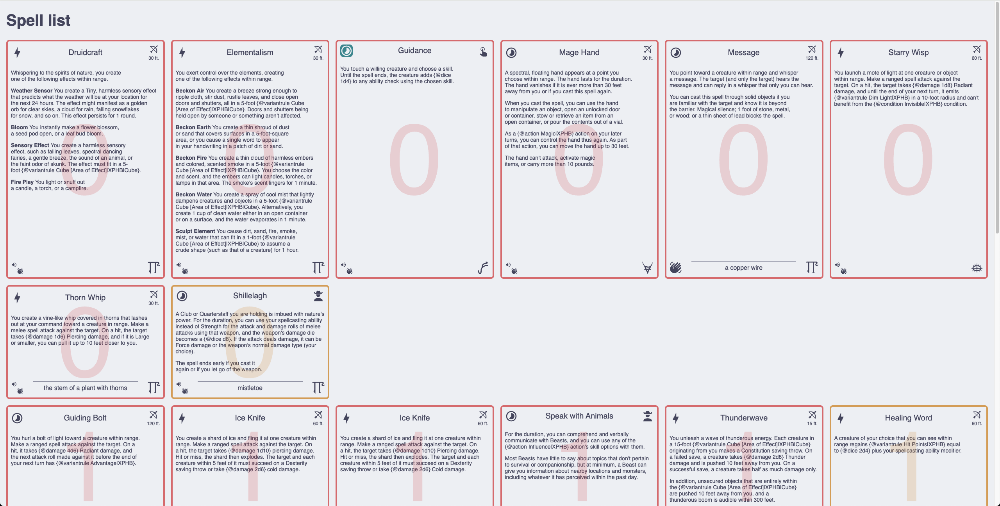
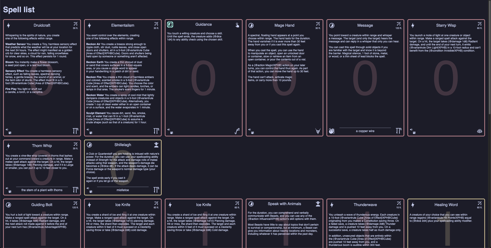

# spell-overview 
Looks like this




## I want to develop stuff 👨🏽‍💻

make sure you have node installed (I use pnpm as package manager)

```shell
corepack enable 
pnpm install
```

start dev server via

```shell
pnpm dev
```

have fun 🚀

## how to add a page for my character? 🧙🏼‍♂️
1. copy-paste `src/pages/characters/fjord-starbeard.astro` with the name of your character
2. adjust the spell list
3. check if all spells are found, by starting the dev server and looking at your character page
4. create a pull request